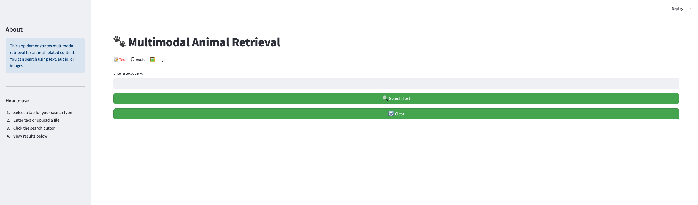

# Retrieval multimodal de animales



En este repo se encuentra un demo de una aplicación que hace retrieval multimodal de audio e imagénes de animales. Esta ejemplo fue desarrollado para Medellín IA.

## Pasos para utilizar el repo
### 1. Clonar el repo
```bash
git clone https://github.com/carlos-osorio-alcalde/medellin-ai
```

### 2. Crear el ambiente
```bash
python -m venv venv && . venv/bin/scripts && pip install -r requirements.txt
```

### 3. Descargar las imágenes
```bash
python -m data.download
```

### 4. Inicializar qdrant
Esta aplicación utiliza la imagen oficial de Docker de Qdrant para correrlo. Por lo tanto, Docker debe estar instalado en la máquina y el Docker daemon debe estar corriendo. Una vez teniendo estos elementos, se puede ejecutar:
```bash
. scripts/run_qdrant.sh
```

### 5. Crear las colecciones en Qdrant
```bash
python -m rag.create_collections --collection both
```

### 6. Poblar las colecciones en Qdrant
```bash
python -m rag.upsert_vectors --collection both
```

### 7. Ejecutar la aplicación de Streamlit
```bash
python -m streamlit run front/app.py
```

Esta aplicación utiliza modelos locales descargados desde Huggingface y sus repos oficiales, por lo que en la primera ejecución es posible que tarde un momento en inicializar.


